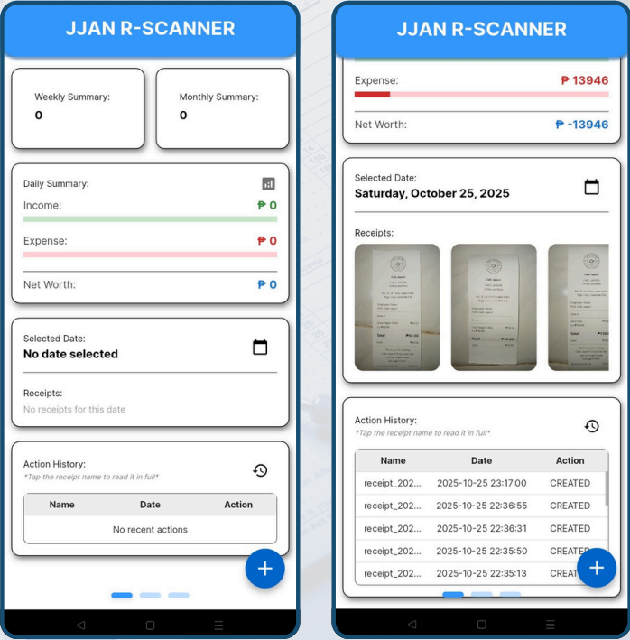
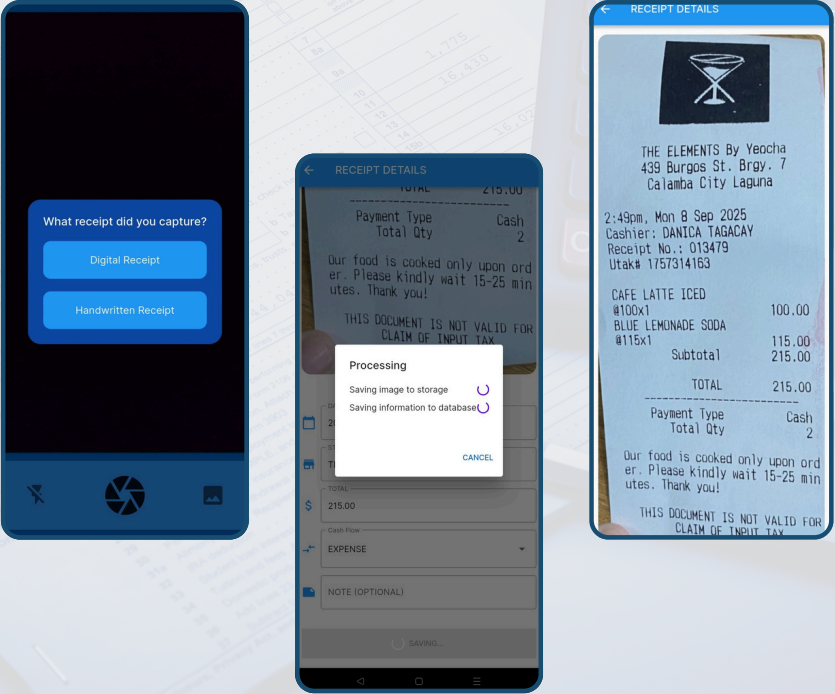
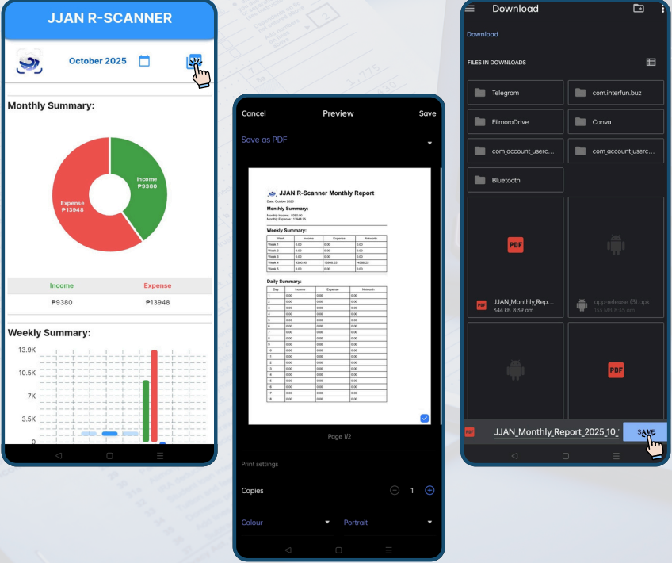

# JJAN-R-Scanner

# 🧾 Automated Subsidiary Ledger for Micro-Businesses
### Via Receipt Scanning Using EasyOCR and YOLOv8

A mobile app that helps small, informal businesses automatically digitize their receipts into a subsidiary ledger — no manual data entry required. Point your camera at a receipt, and the app detects it, extracts the text, and logs the transaction for you.

This was our undergraduate **thesis project**, built to explore how computer vision and OCR could make basic bookkeeping accessible to micro-business owners who don't have the time, tools, or accounting background to track their finances manually.

> ⚠️ **Note:** This project was built under a tight academic deadline. The main goal during development was simply to get it working and finished on time — so the code isn't fully polished, optimized, or extensively documented. It's shared here as a portfolio piece and proof of concept, not production-ready software. It has also been untouched since submission, so some parts (especially the backend/API) may no longer run without updates to dependencies or credentials.

---

## 📱 What It Does

- **Scans receipts** using the phone camera
- **Detects and localizes** the receipt content using a custom-trained **YOLOv8** model
- **Extracts text** (item names, prices, totals, dates, etc.) using **EasyOCR**
- **Automatically records** each scanned receipt as an entry in a digital subsidiary ledger
- Gives micro-business owners a simple way to track expenses/sales without manual bookkeeping

---

## 📸 Screenshots

<!-- Add your images to a `screenshots/` folder in the repo root, then reference them below -->

| Home | Scan Receipt | Ledger View |
|------|--------------|-------------|
|  |  |  |

## 🎥 Demo Video

[Watch the full walkthrough here](#) <!-- Replace with your YouTube/Drive link -->

---

## 🛠️ Tech Stack

**Frontend**
- Flutter & Dart

**Backend / Infrastructure**
- FastAPI (Python) — API layer for handling ML inference requests
- Firebase — authentication & data storage
- Cloudinary — image storage/hosting
- Hugging Face — model deployment/hosting

**Machine Learning**
- **YOLOv8** — custom-trained object detection model for locating receipts/text regions
- **EasyOCR** — text extraction from detected regions

---

## 🧠 How It Works (High-Level)

1. The Flutter app captures or uploads a receipt image.
2. The image is sent to a FastAPI backend, which forwards it to the YOLOv8 model (hosted on Hugging Face) to detect relevant regions on the receipt.
3. The detected regions are passed to EasyOCR to extract the text.
4. Extracted data is parsed and structured into ledger entries.
5. Entries are saved and displayed in-app, stored via Firebase.

---

## ⚙️ Setup / Running Locally

This project hasn't been maintained since our thesis defense, so some steps below may need troubleshooting (expired API keys, dependency updates, etc.) if you want to run it yourself.

1. Clone the repo
   ```bash
   git clone <your-repo-url>
   cd <project-folder>
   ```
2. Install Flutter dependencies
   ```bash
   flutter pub get
   ```
3. Set up your own Firebase project and add the config files (`google-services.json` / `GoogleService-Info.plist`).
4. Set up your own Cloudinary account and API keys.
5. The FastAPI backend and YOLOv8/EasyOCR model were deployed separately on Hugging Face — you'll need to redeploy or run these yourself and point the app to your endpoint.
6. Run the app
   ```bash
   flutter run
   ```

---

## 👥 Team

This was a 4-person thesis project. I was the **sole developer**, responsible for the Flutter app, the YOLOv8/EasyOCR model integration, and backend setup. The model itself was trained from scratch, with my groupmates assisting in **data annotation** for training.

- **Aaron Justin Ortiz** — Developer & Researcher
- **J. Mendoza** — Documentation
- **J. Mamalayan** — Documentation
- **N. Natividad** — Documentation

---

## 📄 License

<!-- Add a license if you'd like, e.g. MIT -->
This project was created for academic purposes as part of a college thesis.
